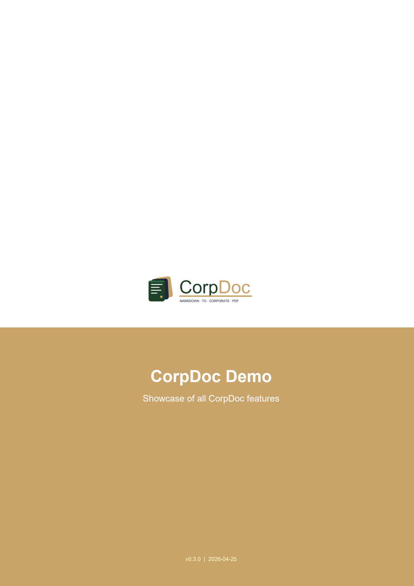

<p align="center">
  
</p>

<p align="center">
  <strong>Turn Markdown into branded corporate PDFs. In seconds.</strong>
</p>

<p align="center">
  <a href="https://github.com/RoCCoCo13/corpdoc/actions/workflows/test.yml"></a>
  <a href="https://github.com/RoCCoCo13/corpdoc/blob/main/LICENSE"></a>
  <a href="https://www.python.org/"></a>
</p>

---

## See it in action

Drop in your logo and CorpDoc automatically derives your brand palette:

<p align="center">
  
  <br/>
  <em>CorpDoc self-demo — forest/camel palette from the CorpDoc logo</em>
</p>

---

## What is CorpDoc?

CorpDoc is an open-source tool that converts plain Markdown into professional
corporate PDFs with almost zero manual layout work. Drop in your **logo** and
a **YAML config** once, and every document you produce afterwards comes out
branded, paginated, and ready to send to clients.

**The killer feature:** CorpDoc is designed to be driven by AI. A single
`SKILL.md` file teaches any LLM (Claude, GPT, Gemini, local Ollama models)
how to generate CorpDoc-compatible Markdown. Your workflow becomes:

```
prompt the AI → AI generates Markdown → corpdoc render → done
```

## Why CorpDoc exists

Because this shouldn't take an afternoon in Word every time you need to send
an offer. It should take 30 seconds.

AI models generate great text. They don't generate professional layouts.
CorpDoc bridges that gap without requiring you (or the AI) to learn LaTeX,
Typst, or fight with Word templates.

---

## Features

- 🎨 **Extracts brand colors automatically** from your SVG logo
- 📄 **Cover page** with 4 styles to pick from (classic, minimal,
  bold-band, split) — configurable in the YAML
- 📋 **Version history** page for document control (change log)
- 📚 **Auto table of contents** from your headings
- 🏷️ **Branded headers and footers** with company info on every page
- 📊 **Auto-styled tables** with zebra striping in your brand colors
- 📐 **Auto-landscape for wide tables** — 8+ column tables rotate the page
  so content stays readable
- 🌐 **Language detection** (English, Spanish, German, French) — pagination
  and labels localize automatically
- 📐 **Nested lists**, inline formatting, code blocks, Mermaid diagrams
- 🤖 **AI-ready** — comes with a `SKILL.md` any LLM can follow

---

## Quickstart

### 1. Install

```bash
pip install corpdoc
```

Or from source:

```bash
git clone https://github.com/RoCCoCo13/corpdoc.git
cd corpdoc
pip install -e .
```

### 2. Create a config from your logo

```bash
corpdoc init --logo my-logo.svg --name "My Company SL"
```

This extracts the brand colors from your logo and writes a `corpdoc.yml`
template. Open it and fill in your footer info (address, director, VAT, etc.).

### 3. Write (or generate) a Markdown document

```markdown
---
title: "Project Proposal"
subtitle: "For ACME Industrial"
reference: "OFR-2026-0042"
version: "1.0"
---

# 1. Executive Summary

We propose the installation of a 500 kWp photovoltaic system...
```

### 4. Render it

```bash
corpdoc render proposal.md --config corpdoc.yml
```

Open `proposal.pdf`. Done.

---

## AI-driven workflow

The `skill/SKILL.md` file in this repo is the manual for any LLM. Paste it
into your Claude / ChatGPT / Gemini / Ollama system prompt and the model will
generate CorpDoc-compatible Markdown on demand.

**Example prompt to your AI:**

> "Using the CorpDoc skill, draft an offer for installing HVAC in a 2,000 m²
> warehouse for ClienteCorp. Budget around €45k. Include timeline and team
> section."

The AI writes the Markdown. You run `corpdoc render`. The PDF lands in your
clients' inbox 30 seconds later.

See the [AI Integration Guide](docs/ai-integration.md) for detailed workflows.

---

## Examples

A complete example is included in `examples/corpdoc-sample/` — a self-referential
demo using CorpDoc's own logo (forest + camel) that exercises every feature in one file.

```bash
cd examples/corpdoc-sample
corpdoc render demo.md --config corpdoc.yml
```

---

## Project structure

```
corpdoc/
├── src/corpdoc/            # Python package
│   ├── api.py              # Main CorpDoc class
│   ├── cli.py              # Command-line interface
│   ├── colors.py           # SVG color extraction
│   ├── parser.py           # Markdown parser
│   ├── canvas.py           # Header/footer drawing
│   ├── flowables.py        # Cover page, custom flowables
│   └── styles.py           # Paragraph and table styles
├── skill/
│   └── SKILL.md            # Instructions for any LLM
├── examples/
│   └── corpdoc-sample/     # Self-referential demo
├── assets/
│   └── corpdoc-logo.svg    # CorpDoc's own brand mark
├── docs/                   # Extended documentation
└── tests/                  # Unit tests
```

---

## Roadmap

- [x] **v0.3** — Core rendering, SVG color extraction, AI skill
- [ ] **v0.4** — Native SVG rendering, auto-landscape for wide tables,
  configurable cover styles, i18n module *(in progress)*
- [ ] **v0.5** — Mermaid diagram rendering via Quarto/Kroki fallback
- [ ] **v0.6** — DOCX export via Pandoc pipeline
- [ ] **v0.7** — Template gallery (offers, reports, memos, contracts)
- [ ] **v1.0** — Stable API, PyPI release, comprehensive test suite

See [CHANGELOG.md](CHANGELOG.md) for release history.

---

## Contributing

Contributions welcome! Areas we'd love help with:

- Additional document templates (legal briefs, academic papers, invoices)
- Language support beyond en/es/de/fr
- Better diagram rendering
- Integrations (VS Code extension, Obsidian plugin, GitHub Action)

See [CONTRIBUTING.md](CONTRIBUTING.md) for guidelines.

---

## License

MIT — see [LICENSE](LICENSE). Use it for anything, commercial or otherwise.

---

## Credits

Built by [Alejandro Méndez](https://github.com/RoCCoCo13) because nobody should
spend 2 hours maquetting a proposal in Word when an AI can generate the
content in 30 seconds.

If CorpDoc saves you time, a ⭐ on GitHub goes a long way.
