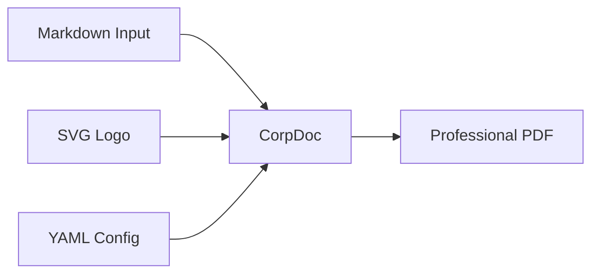

# Welcome to CorpDoc

**CorpDoc** turns plain Markdown into professional corporate PDFs with zero
manual layout work. This document demonstrates every feature.

## What CorpDoc does

- Extracts **brand colors** automatically from your SVG logo
- Generates a branded **cover page** with title and subtitle
- Adds a **version history** page for document control
- Builds an **automatic table of contents**
- Renders **headers and footers** on every page with your company info
- Formats **tables** with zebra striping in your brand colors
- Supports **nested lists** with proper indentation
- Handles **Mermaid diagrams** as styled blocks
- Detects the **document language** automatically

---

# 1. Text Formatting

CorpDoc supports inline markdown: **bold text**, *italic text*, ***bold italic***,
and `inline code`. Paragraphs are justified and use a professional serif-free
font stack for readability.

## 1.1 Bullet Lists

Simple bullet lists:

- First item
- Second item
- Third item

Nested lists (use 2-space indent for sub-items):

- **Phase 1: Planning**
  - Requirements gathering
  - Stakeholder interviews
  - Initial design mockups
- **Phase 2: Development**
  - Backend implementation
  - Frontend integration
  - Automated testing
- **Phase 3: Deployment**
  - Staging rollout
  - Production deployment
  - Post-launch monitoring

## 1.2 Headings Hierarchy

The document supports four heading levels (H1 through H4), each styled
in the brand colors with appropriate spacing.

### This is an H3

Used for sub-sections within a main chapter.

#### This is an H4

Used for fine-grained subdivisions.

---

# 2. Tables

Tables are automatically styled with brand colors. The header row uses the
primary color, and even rows get a subtle tint of the accent color.

## 2.1 Simple Table

| Feature | Status | Priority |
|---------|--------|----------|
| Cover page | ✓ Done | High |
| Version history | ✓ Done | High |
| Auto TOC | ✓ Done | High |
| Nested lists | ✓ Done | Medium |
| Mermaid diagrams | Partial | Medium |
| Multi-language | ✓ Done | Low |

## 2.2 Wider Table (6+ columns)

| Phase | Duration | Team | Budget | Status | Risk |
|-------|----------|------|--------|--------|------|
| Planning | 2 weeks | 3 | €5,000 | Done | Low |
| Design | 3 weeks | 5 | €12,000 | Done | Medium |
| Development | 8 weeks | 8 | €45,000 | In Progress | Medium |
| Testing | 2 weeks | 4 | €8,000 | Pending | Low |
| Deployment | 1 week | 2 | €3,000 | Pending | High |

---

# 3. Diagrams

Mermaid diagrams are rendered as styled information blocks in the brand colors.
(Full Mermaid rendering requires the Quarto pipeline, which is on the roadmap.)

---

# 4. How It Works

CorpDoc is a small, focused Python package. The pipeline is intentionally
simple:

1. Read the Markdown input file
2. Parse YAML frontmatter and body blocks
3. Extract brand colors from the SVG logo
4. Generate the cover page with accent color block
5. Render the version history page
6. Build the automatic table of contents
7. Emit the body content with styled elements
8. Apply header and footer to every content page
9. Write the final PDF

---

# 5. Configuration

All branding is defined in a single `corpdoc.yml` file. Once set up, the same
configuration can be reused for every document your company produces.

The config controls the company name, tagline, logo paths, footer fields, and
typography defaults. The color palette is derived automatically from the logo.

---

# 6. Next Steps

Visit **github.com/RoCCoCo13/corpdoc** for the full documentation, more examples,
and installation instructions.

Contributions are welcome!
